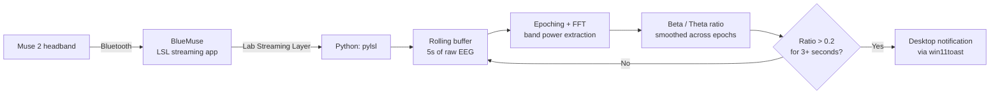

# Wavelength

**A real-time focus monitor that reads your brain's electrical activity through an EEG headband and nudges you back on task the moment your concentration drops.**


---

## 🧠 What is this, in plain English?

Wavelength is a focus tracker that reads directly from your brain instead of guessing from your screen time or keyboard activity. It uses a Muse 2 EEG headband to measure your real-time brainwave activity, and specifically tracks the balance between two frequency bands — **beta waves** (associated with active concentration) and **theta waves** (associated with drowsiness or mind-wandering). When that ratio dips out of a focused range for a few seconds straight, Wavelength sends a desktop notification telling you to get back on track.

It's a small, personal answer to a real problem: attention spans are shrinking, and that has real consequences — for productivity, for learning, and disproportionately for people with ADHD, who often struggle to sustain focus on tasks that aren't inherently engaging. Rather than relying on willpower or app-blockers, Wavelength measures the thing that's actually happening in your brain and reacts to *that*.

---

## ⚙️ How it works



1. **Signal acquisition.** The Muse 2 streams raw EEG data over Bluetooth to BlueMuse, which exposes it as a Lab Streaming Layer (LSL) source — a standard protocol for real-time biosignal streaming. Python connects to that stream with `pylsl` and pulls new samples in small chunks as they arrive.
2. **Buffering.** Incoming samples are pushed into a rolling 5-second circular buffer (`BUFFER_LENGTH`), so the system always has a recent window of signal to analyze rather than operating on single noisy samples.
3. **Epoching.** That buffer is broken into 1-second epochs with 0.8 seconds of overlap between consecutive epochs (an 0.2s shift), which keeps the analysis update rate fast while still giving the FFT a full second of data to work with each time.
4. **Frequency decomposition.** Each epoch is de-meaned, windowed with a Hamming function to reduce spectral leakage, and passed through an FFT to produce a power spectral density. That spectrum is then split into the four classic EEG frequency bands by averaging power within each band's frequency range — delta (<4 Hz), theta (4–8 Hz), alpha (8–12 Hz), and beta (12–30 Hz) — and log-scaled into the final feature vector. A 55–65 Hz notch filter (a 4th-order Butterworth bandstop, applied with its filter state carried across buffer updates so there's no discontinuity between chunks) strips out electrical mains interference upstream of all of this.
5. **The focus metric.** Beta power is divided by theta power for each epoch, then averaged across all epochs currently in the buffer to smooth out momentary noise. This beta/theta ratio is a metric used in real neurofeedback research, particularly in the context of ADHD.
6. **Debounced alerting.** Rather than firing a notification the instant the ratio crosses the threshold (which would trigger constantly on normal signal noise), the system only reacts once the ratio has stayed above the focus threshold continuously for more than 3 seconds — a simple but important debounce that's the difference between a useful tool and an annoying one.

---

## 🔬 The technical core

```python
beta_metric = smooth_band_powers[Band.Beta] / smooth_band_powers[Band.Theta]

if beta_metric > .2 and (datetime.now() - t).seconds > 3:
    toast("This is a friendly reminder to FOCUS", "Please stop getting distracted.")
```

Small on the page, but every constant here reflects a design decision made from real signal behaviour rather than picked arbitrarily:

- **`0.2` threshold** — determined empirically by observing the beta/theta ratio during genuinely focused vs. distracted states on real recorded sessions, not a textbook default.
- **`3` second dwell time** — long enough to filter out normal micro-fluctuations in the ratio, short enough that the feedback still feels real-time.
- **Epoch overlap (0.8s of 1s)** — a deliberate trade-off: more overlap means the ratio updates more often (more epochs per second), at the cost of epochs no longer being fully independent samples.

---

## 🧰 Tech Stack

| Layer | Technology |
|---|---|
| Language | Python |
| EEG hardware | Muse 2 headband |
| Device streaming | BlueMuse (Muse → Lab Streaming Layer) |
| Stream ingestion | `pylsl` |
| Signal processing | NumPy (FFT, buffering), adapted from the official [muse-lsl](https://github.com/alexandrebarachant/muse-lsl) example pipeline |
| Notifications | `win11toast` |

---

## 🙏 Attribution

The raw signal-processing layer — `utils.py`, containing the circular buffering, epoching, notch filtering, and FFT-based band-power extraction — is the unmodified official utility module from the open-source [`muse-lsl`](https://github.com/alexandrebarachant/muse-lsl) project (credited in-file to its original author, Cassani). The base structure of the acquisition loop (connecting to the LSL stream, initializing buffers, the acquire → compute → print cycle) also follows `muse-lsl`'s official `neurofeedback.py` example.

**The original contribution here is everything built on top of that foundation:** turning raw band powers into a validated focus metric, empirically tuning the focus threshold and debounce timing against real recorded sessions, and wiring it into a live, actionable desktop notification system via `win11toast` — turning a signal-processing example script into an actual usable focus tool.

---

## 🛠️ Getting Started

**Hardware:** [Muse 2 headband](https://choosemuse.ca/pages/product-landing).

1. Install [BlueMuse](https://github.com/kowalej/BlueMuse), pair your Muse 2, and start an LSL stream.
2. Install Python 3.11 and the required packages: `pylsl`, `numpy`, `matplotlib`, `win11toast`.
3. Run the monitor script — it will automatically detect the active EEG stream, start buffering, and begin printing your live beta/theta ratio to the console.
4. Keep working normally. When your focus dips for more than 3 seconds, you'll get a desktop reminder to get back on track.

---

## 🔮 Future Work

- Adaptive, per-user threshold calibration instead of a fixed 0.2 cutoff (a short guided "focused" vs. "distracted" baseline session at startup)
- Multi-channel analysis instead of a single electrode, for a more robust signal
- A lightweight logging/dashboard view of focus trends over a work session
- Cross-platform notifications (currently Windows-only via `win11toast`)
- Gentler, escalating nudges instead of a single fixed alert

---

## 💡 Why I built this

Attention spans are shrinking — and short attention spans make it harder to concentrate, retain information, and manage stress, with an outsized impact on people with ADHD, who often struggle most with sustaining focus on tasks that aren't inherently engaging. Rather than another screen-time blocker, Wavelength measures concentration at its source: the brain itself. I wrote more about the reasoning and full build process here: [*Building a Focus-Level Monitor to Tackle Short Attention Spans*](https://medium.com/@karinakainth30/building-a-focus-level-monitor-to-tackle-short-attention-spans-b9ff1b340bff).
